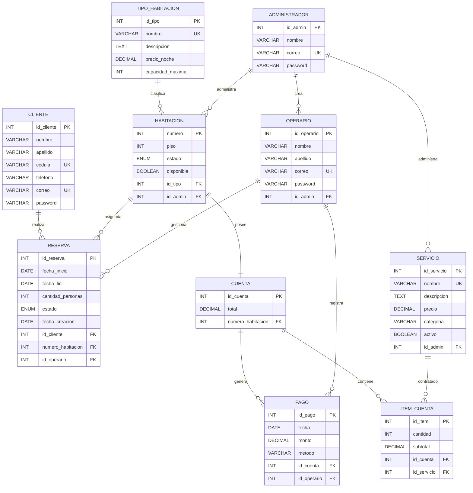
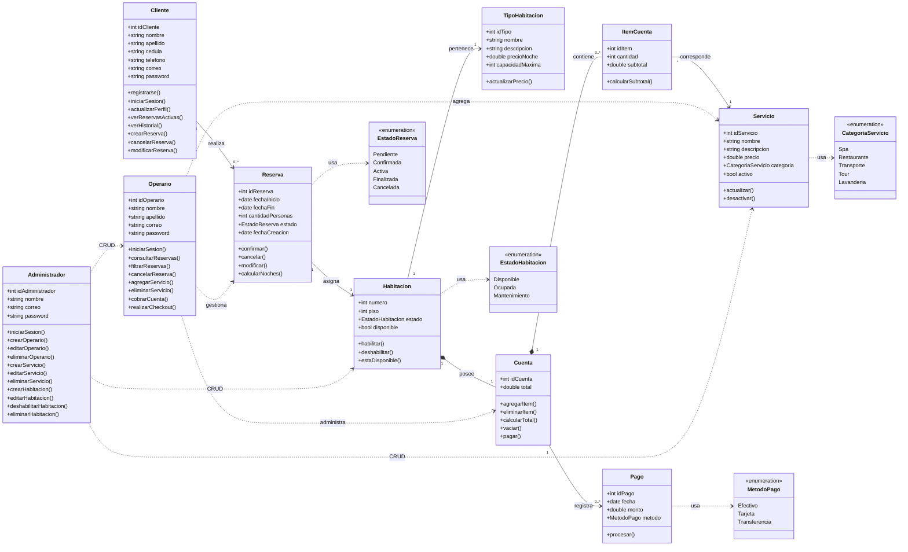

# Atlan Suites – Hotel Management System

Atlan Suites es un sistema de gestión hotelera desarrollado como proyecto semestral de Desarrollo Web. La aplicación permite administrar reservas, habitaciones, servicios, cuentas de consumo y los diferentes portales para clientes, operarios y administradores.

## Diseño

El diseño de la interfaz está disponible en Figma:

**Figma:** https://www.figma.com/design/AzKmb3UaMsc4t8JZCZXiL4/AtlanSuites?node-id=0-1&t=IUIAEeybnugZna8y-1
** Figma Interactivo:** https://pants-toggle-56795002.figma.site

### Identidad visual

#### Logo

#### Paleta de colores

---

## Navigation Diagram

[Open the interactive navigation diagram (download and open it in your browser)](<ReadMe assets/NavigationDiagramSprint2AtlanSuites.html>)

1. **Home:** `/home` — Landing page
2. **Suites:** `/suites` — Catálogo de habitaciones (con botones para ver detalles)
   - **Suite Detail:** `/suites/{suiteId}` — Detalle de una habitación (con botón para reservar)
3. **Book Now:** `/book-now` — Diligenciar fechas de entrada, salida y número de huéspedes
4. **Check Availability:** `/check-availability` — Mostrar las habitaciones realmente disponibles según los datos de Book Now y, si se llegó desde una suite, filtrar también por la habitación seleccionada
   - **Guest Details:** `/guest-details` — Datos del huésped
   - **Payment:** `/payment` — Pago y confirmación
5. **Experiences:** `/experiences` — Catálogo de experiencias que no sean de temporada ni románticas
   - **Experiences Detail:** `/experiences/{experienceId}` — Detalle de una experiencia específica
   - **Seasonal Events:** `/experiences/seasonal-events` — Catálogo de eventos de temporada
   - **Seasonal Event Detail:** `/experiences/seasonal-events/{eventId}` — Detalle de un evento de temporada
   - **Romantic Experiences:** `/experiences/romantic-experiences` — Catálogo de experiencias románticas
   - **Romantic Experience Detail:** `/experiences/romantic-experiences/{experienceId}` — Detalle de una experiencia romántica
6. **Getting Here:** `/getting-here` — Mapa para visualizar dónde queda el hotel
7. **Explore the Hotel:** `/explore` — Fotos y videos del hotel por dentro y por fuera
8. **Restaurant:** `/restaurant` — Fotos del restaurante
   - **Restaurant Menu:** `/restaurant/menu` — Menú del restaurante
9. **Hotel Awards:** `/awards` — Premios otorgados al hotel
10. **Services List:** `/services/list`
11. **Services Cards:** `/services/cards`
12. **Service:** `/services/{serviceName}`

---

# Diagrama Entidad–Relación (ER)

Este diagrama representa la estructura de la base de datos del sistema. Muestra las entidades, sus atributos, claves primarias (PK), claves foráneas (FK), restricciones de unicidad (UK) y las relaciones de cardinalidad entre ellas.

---

# Diagrama de Clases (UML)

Este diagrama describe la arquitectura orientada a objetos del proyecto. Incluye las clases principales del dominio, sus atributos, métodos, enumeraciones y las relaciones existentes entre clientes, reservas, habitaciones, servicios y los distintos roles del sistema.

